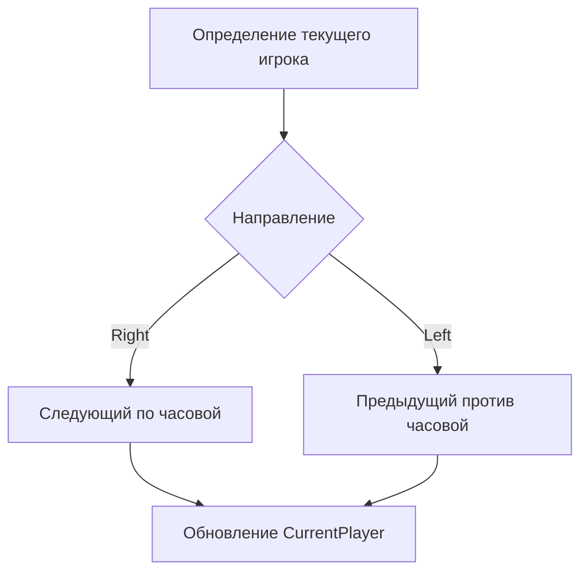
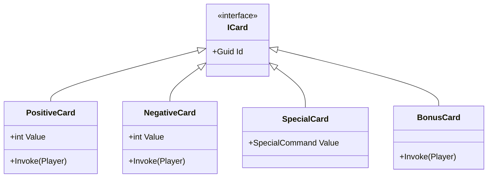
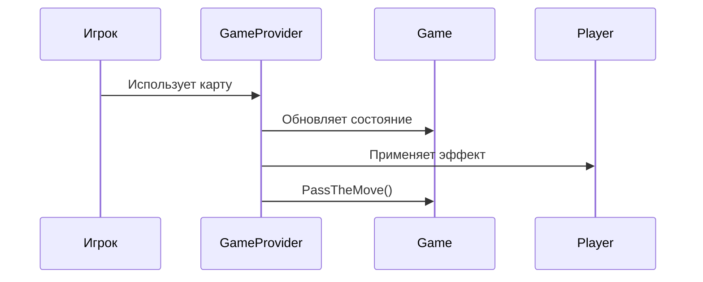
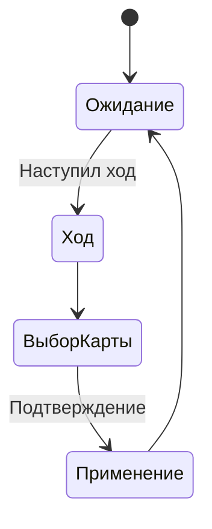

# Модели (Models.cs)

## Содержание

1. [Интерфейс IGameProvider](modeli-models.cs.md#интерфейс-igameprovider)
2. [Классы карт](modeli-models.cs.md#классы-карт)
3. [Игровые сущности](modeli-models.cs.md#игровые-сущности)
4. [Диаграммы](modeli-models.cs.md#диаграммы)

***

## Интерфейс IGameProvider

### Основные методы

```csharp
public interface IGameProvider
{
    void DrawCard(ref Player player);
    void PassTheMove(ref Game game);
    void UseCardAttachedToPlayer(ICard card, ref Player player);
    void UseCardAttachedToGame(ICard card, ref Game game);
}
```

### Реализация в `GameProvider`

#### 1. Раздача карт

```csharp
public void DrawCard(ref Player player)
{
    for (int i = player.Deck.Count; i < 6; i++)
        player.Deck.Add(CardDeck.DrawRandomCard());
}
```

* Добивает руку игрока до 6 карт
* Использует `CardDeck.DrawRandomCard()`

#### 2. Передача хода



#### 3. Использование карт

| Тип карты                | Эффект                         |
| ------------------------ | ------------------------------ |
| `SpecialCard.Silence`    | Пропуск хода следующего игрока |
| `SpecialCard.ChangeMove` | Смена направления хода         |
| `PositiveCard`           | Увеличение счета               |
| `NegativeCard`           | Уменьшение счета (не ниже 0)   |
| `BonusCard`              | Удвоение счета                 |

***

## Классы карт

### Иерархия карт



### Генерация карт (`CardDeck`)

Вероятности выпадения:

* 80%: Числовые карты (50/50 позитивные/негативные)
* 15%: Спецкарты
* 5%: Бонусные карты

***

## Игровые сущности

### Класс `Player`

```csharp
public class Player
{
    public Guid Id { get; set; }
    public string Name { get; set; }
    public List<ICard> Deck { get; set; }
    public int Score { get; set; } = 10;
    public bool HasCombo { get; set; }
    // ... другие свойства
}
```

### Класс `Game`

```csharp
public class Game
{
    public Guid GameID { get; set; }
    public Direction Direction { get; set; }
    public Guid CurrentPlayer { get; set; }
    public List<Player> Players { get; set; }
    public int MaxScore { get; set; } = 300;
}
```

### Перечисления

```csharp
public enum Direction { Right, Left }
public enum SpecialCommand { Silence, ChangeMove }
```

***

## Диаграммы

### Последовательность хода



### Состояния игрока



***

## Особенности реализации

1.  **Иммутабельность**:

    * Все изменения возвращают новые объекты:

    ```csharp
    game = new Game() { /* обновленные поля */ }
    ```
2. **Безопасность**:
   * Проверка на отрицательный счет
   * Защита от переполнения руки карт
3. **Расширяемость**:
   * Легко добавить новые типы карт через `ICard`
