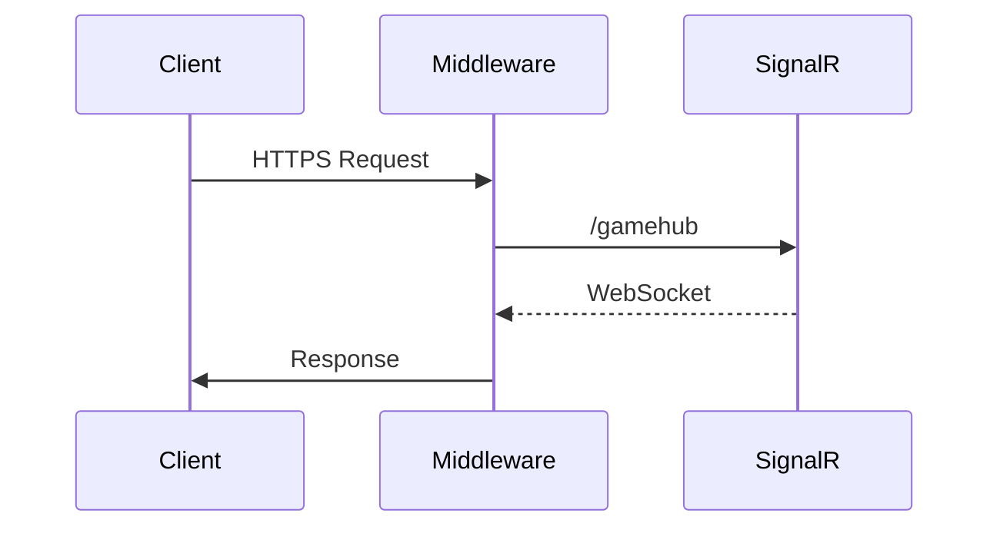
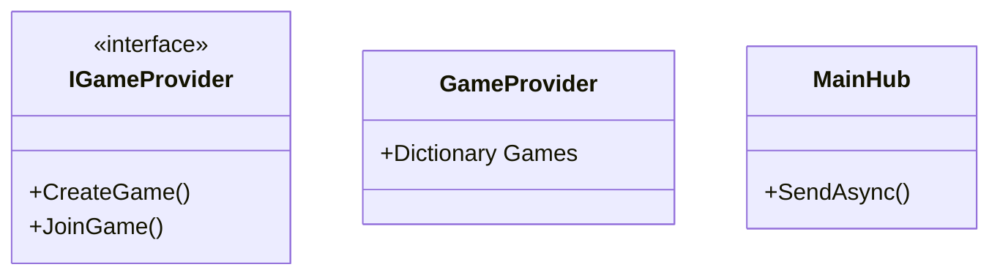

# Настройка серверной части (Program.cs)

## Содержание

1. [Конфигурация сервисов](nastroika-servernoi-chasti-program.cs.md#конфигурация-сервисов)
2. [Настройка SignalR](nastroika-servernoi-chasti-program.cs.md#настройка-signalr)
3. [Middleware Pipeline](nastroika-servernoi-chasti-program.cs.md#middleware-pipeline)
4. [Сериализация JSON](nastroika-servernoi-chasti-program.cs.md#сериализация-json)
5. [Зависимости](nastroika-servernoi-chasti-program.cs.md#зависимости)

***

## Конфигурация сервисов

### Основные сервисы

```csharp
builder.Services.AddRazorComponents()
    .AddInteractiveServerComponents();
```

### Пользовательские сервисы

| Сервис             | Тип       | Описание                        |
| ------------------ | --------- | ------------------------------- |
| `IGameProvider`    | Singleton | Хранит состояние игровых сессий |
| `GameTimerService` | Transient | Управление игровыми таймерами   |
| `ILogger`          | Singleton | Логирование системы             |

***

## Настройка SignalR

### Параметры подключения

```csharp
.AddSignalR(options => 
{
    options.ClientTimeoutInterval = TimeSpan.FromSeconds(4);
    options.KeepAliveInterval = TimeSpan.FromSeconds(2);
})
```

### Хаб

```csharp
app.MapHub<MainHub>("/gamehub");
```

***

## Middleware Pipeline



### Порядок обработки:

1. `UseHttpsRedirection()` - Перенаправление на HTTPS
2. `UseStaticFiles()` - Статические файлы (CSS/JS)
3. `UseAntiforgery()` - Защита от CSRF
4. `MapRazorComponents()` - Blazor Components

***

## Сериализация JSON

### Настройки Newtonsoft.Json

```csharp
new JsonSerializerSettings
{
    NullValueHandling = NullValueHandling.Ignore,
    Formatting = Formatting.None,
    TypeNameHandling = TypeNameHandling.Auto,
    ContractResolver = new CamelCaseNamingStrategy()
}
```

**Особенности:**

* Поддержка полиморфизма через `TypeNameHandling.Auto`
* Игнорирование null-значений
* camelCase-нотация для свойств

***

## Зависимости

### Необходимые пакеты NuGet

```xml
<PackageReference Include="Microsoft.AspNetCore.SignalR" Version="..."/>
<PackageReference Include="Newtonsoft.Json" Version="..."/>
<PackageReference Include="Microsoft.AspNetCore.Components.Web" Version="..."/>
```

### Пользовательские классы



***

## Переменные окружения

| Ключ                     | Значение по умолчанию | Описание                              |
| ------------------------ | --------------------- | ------------------------------------- |
| `ASPNETCORE_ENVIRONMENT` | Production            | Режим работы (Development/Production) |
| `ASPNETCORE_HTTPS_PORT`  | 443                   | HTTPS-порт                            |

