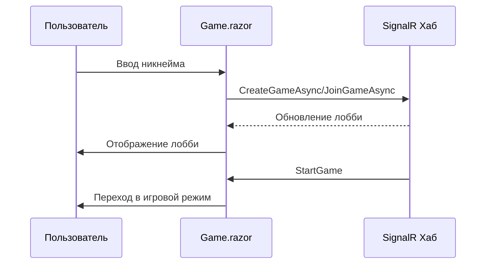
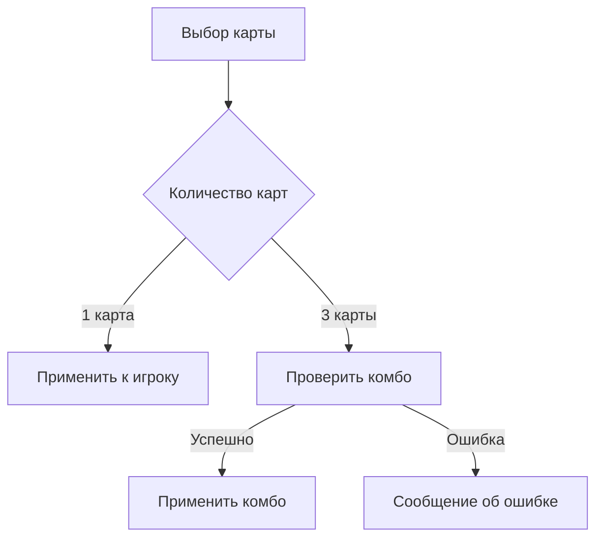

# Диаграммы состояний

## Жизненный цикл компонента

```mermaid
sequenceDiagram
    participant UI as Пользователь
    participant Component as Game.razor
    participant Server as SignalR Хаб

    UI->>Component: Ввод никнейма
    Component->>Server: CreateGameAsync/JoinGameAsync
    Server-->>Component: Обновление лобби
    Component->>UI: Отображение лобби
    Server->>Component: StartGame
    Component->>UI: Переход в игровой режим
```

## Обработка хода

```mermaid
flowchart TD
    A[Выбор карты] --> B{Количество карт}
    B -->|1 карта| C[Применить к игроку]
    B -->|3 карты| D[Проверить комбо]
    D -->|Успешно| E[Применить комбо]
    D -->|Ошибка| F[Сообщение об ошибке]
```
