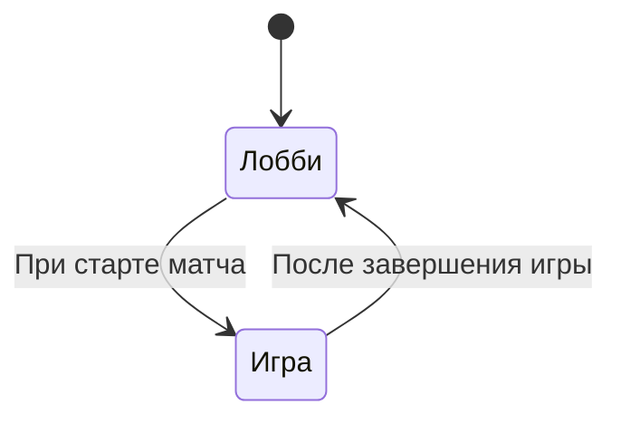

# Игровой компонент (Pages/Play.razor)

Центральный компонент для игры "Царь Горы". Отвечает за:

* Подключение к игровому хабу SignalR
* Отображение лобби и игрового поля
* Обработку игровой логики и взаимодействий

## Состояния компонента

## Структура файлов

| Файл             | Описание                        |
| ---------------- | ------------------------------- |
| `Play-logic.md`  | Логика и SignalR-взаимодействия |
| `Play-ui.md`     | Визуальные компоненты           |
| `Play-states.md` | Диаграммы состояний             |
