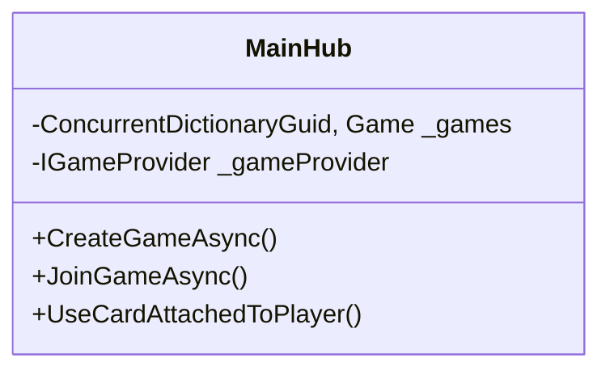

# SignalR Хаб (MainHub.cs)

## Содержание

1. [Обзор](signalr-khab-mainhub.cs.md#обзор)
2. [Методы хаба](signalr-khab-mainhub.cs.md#методы-хаба)
3. [Управление играми](signalr-khab-mainhub.cs.md#управление-играми)
4. [Игровые действия](signalr-khab-mainhub.cs.md#игровые-действия)
5. [Состояния и потоки](signalr-khab-mainhub.cs.md#состояния-и-потоки)

***

## Обзор

Основной хаб для управления игровым процессом. Обрабатывает

* Созданиеудаление игровых сессий
* Подключениеотключение игроков
* Игровые действия (ходы, использование карт)



***

## Методы хаба

### Управление подключениями

## Метод Описание

`OnDisconnectedAsync` Автоматический выход при разрыве соединения `GetActiveGames` Возвращает список активных игр

### Лобби

## Метод Параметры Клиентское событие

`CreateGameAsync` `playerId, username` `JoinGameLobby`, `GameCreated` `JoinGameAsync` `playerId, username, gameId` `RenderAfterJoinUser`, `JoinGameLobby` `LeaveGameAsync` `gameId` `UpdateAfterLeave`, `ToMainPage`

### Игровой процесс

## Метод Параметры Клиентское событие

`UseCardAttachedToPlayer` `cardIndex, targetPlayer` `ChangePlayerState` `UseCardAttachedToGame` `cardIndex` `ChangeGameState` `EndMove` - `ChangeGameState`

***

## Управление играми

### Жизненный цикл игры

```mermaid
sequenceDiagram
    participant Client
    participant Hub
    participant GameProvider
    
    Client-Hub CreateGameAsync()
    Hub-GameProvider Создание игры
    Hub-Client JoinGameLobby
    Hub-All Clients GameCreated
```

### Хранение состояний

```csharp
private static readonly ConcurrentDictionaryGuid, Game _games;
private static readonly ConcurrentDictionaryGuid, int _gamesPlayersCount;
```

Особенности

* Потокобезопасные коллекции
* Автоматическая очистка пустых лобби
* Блокировки при изменении состояния игры

***

## Игровые действия

### Обработка карт

```mermaid
flowchart TD
    A[Выбор карты] -- B{Тип карты}
    B --PositiveNegative C[Изменение счета]
    B --Special D[Эффект на игру]
    C -- E[Обновление состояния]
    D -- E
```

### Таймер старта игры

```csharp
var timer = new GameTimerService(_logger) {
    OnTimerCompleted = (g) = {
        _games[g].isStarted = true;
        Clients.Group(g).SendAsync(StartGame, _games[g]);
    }
};
await timer.StartTimer(60);
```

***

## Состояния и потоки

### Критические секции

```csharp
lock (_games[gameId].Players) {
    _games[gameId].Players.Add(player);
    _gamesPlayersCount[gameId] += 1;
}
```

### Обработка ошибок

```csharp
try {
     Логика хаба
} 
catch (Exception ex) {
    _logger.LogError(ex, Ошибка в методе X);
    await Clients.Caller.SendAsync(Error, Сообщение);
}
```

***

## Сигналы клиентам

## Событие Назначение

`ChangePlayerState` Обновление данных игрока `ChangeGameState` Смена текущего хода `TimerWasStarted` Запуск таймера лобби `UpdateTimer` Обновление времени таймера

***

## Пример использования

```csharp
 Клиентский код (JavaScript)
connection.on(ChangeGameState, (game) = {
    updateGameUI(game);
});

connection.invoke(UseCardAttachedToPlayer, 2, targetPlayerId);
```

